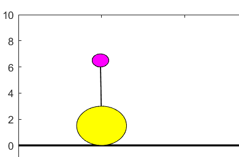
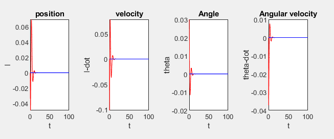

# Inverted-Pedulum
Simulated the **Inverted pendulum** control system using **Matlab Software** and plotted various system parameters as a function of time to understand
and thus improve the current state using **feedback control.**
## Author - Omkar Nitsure
Email - omkarnitsure2003@gmail.com  
github profile - https://github.com/omkarnitsureiitb  

The problem is given to **control the inverted pendulum** in air by giving calculated triggers based on feedback control. I have designed a feedback controller which 
receives various parameters of the pendulum like it's **position, velocity, angle and angular velocity as it's input** and it's job is to calculate the **direction
and magnitude of trigger** to be applied to maintain the pendulum in it's inverted position.

The following is the **setup of the inverted pendulum system** whose state needs to be closely controlled.

The following plots tell the **position ,velocity, angle and angular velocity** of the inverted pendulum as a function of time which helps
also helps the **controller** to control the system.  

